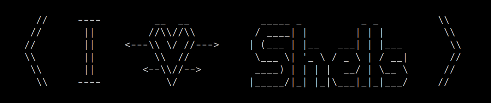

# iv3shells
I &lt;3 Shells (iv3shells) is a script that generates reverse-shells in a quick-and-easy way. It will ask for the information needed (unless given through options), and then copy a command to the clipboard. The main idea behind this script is to simplify the process of creating reverse-shells on a victim while pen-testing.



# Installation
```
git clone https://github.com/arch-err/iv3shells.git
```
## Dependencies
 - xclip
 - fzf

### Arch-based distributions
```
sudo pacman -S fzf xclip
```
### Debian-based distributions
```
sudo apt install fzf xclip
```

# Usage
```
$ ./iv3shells 
IP:
192.168.13.37
PORT:
4444
OS:
linux
*Choose shell*
*Choose reverseshell*
```
OR
```
$ ./iv3shells -h
```
OR
```
$ ./iv3shells -i 192.168.13.37 -p 4444 -o win -e
*Choose reverseshell*
```


